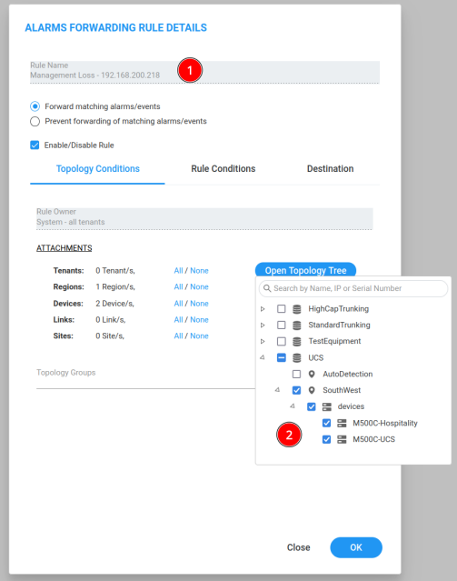
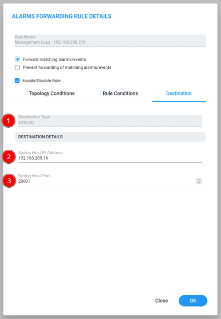

# trafficCapture

<div id="top"></div>

<!-- PROJECT SHIELDS -->
<!--
*** I'm using markdown "reference style" links for readability.
*** Reference links are enclosed in brackets [ ] instead of parentheses ( ).
*** See the bottom of this document for the declaration of the reference variables
*** for contributors-url, forks-url, etc. This is an optional, concise syntax you may use.
*** https://www.markdownguide.org/basic-syntax/#reference-style-links
-->
[![Contributors][contributors-shield]][contributors-url]
[![Forks][forks-shield]][forks-url]
[![Stargazers][stars-shield]][stars-url]
[![Issues][issues-shield]][issues-url]

![Last Commit][last-commit-shield]
![Repo Size][repo-size-shield]


<!-- PROJECT LOGO -->
<br />
<div align="center">
  <a href="https://github.com/dgrissom55/trafficCapture">
    
  </a>

<h3 align="center">trafficCapture</h3>

  <p align="center">
    Synchronize network traffic captures on multiple CPE devices and their associated OVOC servers.
    <br />
    <br />
    <a href="https://github.com/dgrissom55/trafficCapture/issues">Report Bug</a>
    ·
    <a href="https://github.com/dgrissom55/trafficCapture/issues">Request Feature</a>
  </p>
</div>


<!-- TABLE OF CONTENTS -->
---
<details>
  <summary><h2>Table of Contents</h2></summary>
  <ol>
    <li><a href="#change-log">Change Log</a></li>
    <li>
      <a href="#about-the-project">About The Project</a>
    </li>
    <li>
      <a href="#getting-started">Getting Started</a>
      <ul>
        <li><a href="#prerequisites">Prerequisites</a></li>
        <li><a href="#installation">Installation</a></li>
      </ul>
    </li>
    <li><a href="#usage">Usage</a></li>
    <li><a href="#roadmap">Roadmap</a></li>
    <li><a href="#contact">Contact</a></li>
  </ol>
</details>


<!-- CHANGE LOG -->
---
<details>
  <summary><h2>Change Log</h2></summary>

## v1.0.1

### Added or Changed
- Added this changelog. :)
- Modified CPE and OVOC prefix to filenames of stored capture files.
- Output the script version in the section displaying the execution events.
- Added support for managing debug captures on Gateway and SBC devices.
- Added logging of the CLI scripts to the log file.
- Passwords are masked in any logging output.
- When capturing on MSBR devices you can now select multiple WAN interfaces to simultaneously capture on.

## v1.0.0

### Added or Changed
- Only supports managing debug captures for MSBR devices.

</details>

<!-- ABOUT THE PROJECT -->
---
## About The Project

![Product Name Screen Shot][product-screenshot]

The goal of this project is to try and isolate with network traffic captures any anomalies that may be preventing certain traffic types from traversing a WAN. With the scripts in this project, the task of automating the synchronization of network captures on numerous audiocodes MSBR CPE devices with their associated OVOC servers, and collecting the captures is handled.

There are a mimimum of two scripts that will be required to be run. The following is a high level description of each scripts functions:

* `cpe_capture_app.py`

  This script should be run on a separate host server, as depicted in the diagram above, that will have separate network connectivity to access both the CPE devices and the OVOC servers and also the ability to have additional Python modules installed like 'requests', 'paramiko', etc. This script DOES NOT have to be run with 'root' privileges.
                         
  This script is responsible for initiating the `debug capture` commands using REST API calls to the MSBR devices and sending UDP command request messages to synchronize `tcpdump` traffic captures on OVOC servers associated with the targeted CPE devices.

* `ovoc_capture_app.py`

  This script should be run on each OVOC server, as depicted in the diagram above, that is associated with a CPE device being targeted for network traffic captures. This script MUST BE run with 'root' privileges since it will issue system calls to start the linux 'tcpdump' application.
  
  This script receives the UDP command request messages from the CPE capture app and initiates the `tcpdump` that filters captured traffic based on the targeted CPE devices IP address.

<b>Detailed Descriptions:</b>

Running the 'cpe_capture_app.py' script on a separate server other than an OVOC server is required since the goal is to understand why an OVOC server may be losing connectivity with the CPE devices. The intent is that the separate server will not have any loss of connectivity to the CPE device and will be able to remain in communications with the CPE to issue REST API commands to control and retrieve debug captures without failure.

The goal is the attempt catch an event where SNMP traffic is not being seen on the CPE device and it loses management connectivity with the OVOC server.

A major part of the interactive input to the CPE capture script (`cpe_capture_app.py`) is the creation of a list of CPE devices and their associated OVOC servers. The commands to start/stop the debug capture on the audiocodes CPE is sent via REST API to the devices defined from the interactive entries. The traffic captures on the CPE's associated OVOC servers are started and stopped using UDP signaling. Commands are sent from the CPE capture script to the `listen_port` defined for the complementatry OVOC capture Python script (`ovoc_capture_app.py`) running on the appropriate OVOC servers.

On the OVOC servers, the network captures are performed by issuing system calls to the `tcpdump` app. To start a capture on the OVOC server, the CPE capture script sends a `CAPTURE` command to the appropriate OVOC server to inform it which CPE traffic should be captured. The OVOC capture script responds with a `TRYING` when setting up the tcpdump, and then an `OK` response when the tcpdump process is running. The response will be `FAIL` if the capture fails to be started on the OVOC server.

The captures on both the CPE device and the OVOC server are stopped after the `cpe_capture_app.py` script receives the `Connection Lost` SNMP alarm. Each OVOC server in this version of the project must be manually configured with a SNMP forwarding rule to send any received `Connection Lost` alarms to the CPE capture script.
<p>
  (<a href="#ovoc">See the OVOC server prerequisites below.</a>)
</p>

The alarm forwarded from the OVOC servers should be in `SYSLOG` format so that the `cpe_capture_app.py` script can properly parse the contents of the alarm. This SNMP alarm forwarding rule will be automatically created in the appropriate OVOC servers in future releases. Once the alarm has been processed, the CPE capture script will send a `STOP` message to the OVOC server to trigger it to kill the tcpdump process for that CPE device. The `STOP` message also contains the filename of the PCAP capture file retrieved from an SFTP transfer of a stopped CPE `debug capture`. The OVOC server renameds its `tcpdump` files to match the filename of the CPE device for easier correlation.

The following messages are exchanged:

  ```sh
CPE capture script                         OVOC capture server
       |                                           |
       |-------- CAPTURE <device address> -------->|
       |                                           |
       |<-------- TRYING <device address> ---------|
       |                                           |
       |<------- OK | FAIL <device address> -------|
       |                                           |
       |---- STOP <device address> <filename> ---->|
       |                                           |
       |<-------- TRYING <device address> ---------|
       |                                           |
       |<------- OK | FAIL <device address> -------|
       |                                           |
  ```

The CPE capture script `cpe_capture_app.py` tracks capture states, all tasks, and other information for each targeted CPE device. The 'devices_info' dictionary is created to track each devices information. The following is an example of what is tracked:

  ```sh
 {
     "devices": [
         {
             "device": "<device ip address>",
             "username": "<device REST API username>",
             "password": "<device REST API password>",
             "status": "Success|Failure",
             "state": "active|not active",
             "events": "Success|Failure",
             "ovocState": "active|not active",
             "description": "<some description>",
             "lastRequest": "<some command request>",
             "lastResponse": "<some command response>",
             "severity": "NORMAL|MINOR|MAJOR|CRITICAL",
             "tasks": [
                 {
                     "task": "<task name>",
                     "timestamp": "%Y-%m-%dT%H:%M:%S:%f%z",
                     "status": "Success|Failure",
                     "statusCode": <http response status code>,
                     "output": "<CLI script execution>",
                     "description": "<CLI script load status>",
                 },
                 ...
                 <Next Task>
             ]
         },
         ...
         <Next Device>
     ]
 }
 
 For a 'Stop capture' task, the following item is added to the task items:
                     "filename": "<capture filename>",
  ```

The OVOC capture script `ovoc_capture_app.py` tracks capture states, all tasks, and other information for each targeted CPE device. The 'devices_info' dictionary is created to track each devices information. The following is an example of what is tracked:

  ```sh
 {
     "devices": [
         {
             "device": "<device ip address>",
             "status": "Success|Failure",
             "state": "active|not active",
             "description": "<some description>",
             "lastCapture": "<last stopped capture filename>",
             "lastRequest": "<some command request>",
             "lastResponse": "<some command response>",
             "severity": "NORMAL|MINOR|MAJOR|CRITICAL",
             "tasks": [
                 {
                     "task": "<task name>",
                     "timestamp": "%Y-%m-%dT%H:%M:%S:%f%z",
                     "status": "Success|Failure",
                     "description": "<status information>",
                 },
                 ...
                 <Next Task>
             ]
         },
         ...
         <Next Device>
     ]
 }
 
 For a 'Stop capture' task, the following item is added to the task items:
                     "filename": "<capture filename>",
  ```

<p align="right">(<a href="#top">back to top</a>)</p>


<!-- GETTING STARTED -->
## Getting Started


### Prerequisites

This is a list of of requirements for the scripts, the additional modules needed, how to install them.

On the servers hosting the CPE capture script: `cpe_capture_app.py`
* Python 3.6+
* Module `requests` for sending REST API requests to the CPE devices.

  <b>NOTE:</b> CPE devices will need to allow access to TCP port 443.
  ```sh
  pip3 install requests
  ```
* Module `urllib3` for underlying HTTP/S transport.
  ```sh
  pip3 install urllib3
  ```
* Module `pathlib` for managment of logs and capture directories.
  ```sh
  pip3 install pathlib
  ```
* Module `paramiko` for SFTP transfers of capture files from the CPE devices.

  <b>NOTE:</b> CPE devices will need to allow access to TCP port 22.
  ```sh
  pip3 install requests
  ```
<br>

On the OVOC servers hosting the capture script: `ovoc_capture_app.py`
* No prerequisites
<br>

<div id="ovoc"></div>

OVOC Server:
* SNMP alarms must be manually configured to foward to the CPE capture script:

  


<br>


### Installation

<b>NOTE:</b> The `ovoc_capture_app.py` script should be running prior to starting the `cpe_capture_app.py` script(s).

<br>

On OVOC servers:
1. Upload the `ovoc_capture_app` directory to each OVOC server that is used for managing any of the targeted CPE devices.
2. Access each OVOC server using SSH and navigate to the uploaded `ovoc_capture_app` directory.
3. Run the following command:
      
        python ovoc_capture_app.py
<br>


On the servers hosting the CPE capture script:
1. Upload the `cpe_capture_app` directory to a different server in the network that has access to communicate to both the CPE devices and to each OVOC server used.
2. Access the server hosting the CPE capture script using SSH or command line and navigate to the uploaded `cpe_capture_app` directory.
3. Run the following command:
      
        python3 cpe_capture_app.py
<br>


<p align="right">(<a href="#top">back to top</a>)</p>


<!-- USAGE EXAMPLES -->
## Usage

1. Run `ovoc_capture_app.py` on OVOC server managing a targeted CPE device.
2. Run `cpe_capture_app.py` on server that has access to both the CPE device and also the associated OVOC server.

<p align="right">(<a href="#top">back to top</a>)</p>


<!-- ROADMAP -->
## Roadmap

- [ ] Add support for capturing traffic on Mediant Gateway and SBC devices.
- [ ] Add automate creation of SNMP forwarding rules to the `ovoc_capture_app.py` script.

     * When a `CAPTURE` request is received by the OVOC capture script, if a SNMP fowarding rule doesn't already exist for the CPE capture script that sent the request, then a new rule will be added.
- [ ] Create CSV file that has records for each device and details every event and task performed against it.


<p align="right">(<a href="#top">back to top</a>)</p>


<!-- CONTACT -->
## Contact

Doug Grissom - doug.grissom@audiocodes.com

Project Link: [https://github.com/dgrissom55/trafficCapture](https://github.com/dgrissom55/trafficCapture)

<p align="right">(<a href="#top">back to top</a>)</p>


<!-- MARKDOWN LINKS & IMAGES -->
<!-- https://www.markdownguide.org/basic-syntax/#reference-style-links -->
[contributors-shield]: https://img.shields.io/github/contributors/dgrissom55/trafficCapture?style=for-the-badge
[contributors-url]: https://github.com/dgrissom55/trafficCapture/graphs/contributors
[forks-shield]: https://img.shields.io/github/forks/dgrissom55/trafficCapture?style=for-the-badge
[forks-url]: https://github.com/dgrissom55/trafficCapture/network/members
[stars-shield]: https://img.shields.io/github/stars/dgrissom55/trafficCapture?style=for-the-badge
[stars-url]: https://github.com/dgrissom55/trafficCapture/stargazers
[issues-shield]: https://img.shields.io/github/issues/dgrissom55/trafficCapture?style=for-the-badge
[issues-url]: https://github.com/dgrissom55/trafficCapture/issues
[license-shield]: https://img.shields.io/github/license/dgrissom55/trafficCapture?style=for-the-badge
[license-url]: https://github.com/dgrissom55/trafficCapture/blob/master/LICENSE.txt
[linkedin-shield]: https://img.shields.io/badge/-LinkedIn-black.svg?style=for-the-badge&logo=linkedin&colorB=555
[linkedin-url]: https://linkedin.com/in/linkedin_username
[product-screenshot]: images/capturing_flow_v1.0.0.png
[select-devices-screenshot]: images/alarm_fwd_select_devices.png
[select-alarms-screenshot]: images/alarm_fwd_select_alarm.png
[select-destination-screenshot]: images/alarm_fwd_set_type_and_destination.png
[last-commit-shield]: https://img.shields.io/github/last-commit/dgrissom55/trafficCapture?style=for-the-badge
[repo-size-shield]: https://img.shields.io/github/repo-size/dgrissom55/trafficCapture?style=for-the-badge
